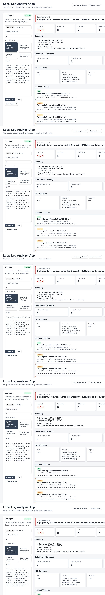
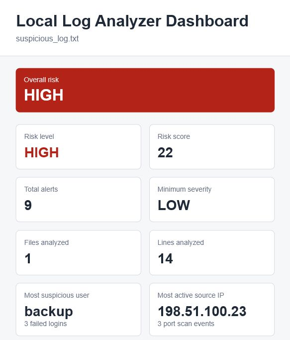

# Local Log Analyzer

A beginner Python cybersecurity project that reads a text log file and reports suspicious activity.

## Live Demo

- [Open the project landing page](https://veggis96.github.io/local-log-analyzer/)
- [Open the browser app](https://veggis96.github.io/local-log-analyzer/app.html)
- [View the generated dashboard](https://veggis96.github.io/local-log-analyzer/dashboard.html)

## Screenshots

### Browser Mini SIEM App



### Generated Dashboard



## What It Detects

- 3 or more failed login attempts from the same user
- `PORT_SCAN` events
- `ACCOUNT_LOCKED` events
- Successful login after repeated failed logins
- Successful login from a new IP after repeated failed logins
- Internal vs external/example IP context for network-related alerts

The failed login alert threshold is currently set to 3.

## Files

- `analyzer.py` - the Python script
- `sample_log.txt` - fake log data for testing
- `suspicious_log.txt` - a more realistic fake log file with several alert types
- `clean_log.txt` - fake log data with no alerts
- `extra_sample.log` - fake `.log` data for testing folder analysis
- `scenario_brute_force.txt` - demo scenario for repeated failed logins
- `scenario_port_scan.txt` - demo scenario for source IP port scanning
- `scenario_account_takeover.txt` - demo scenario for failed logins followed by success from a new IP
- `scenario_clean_baseline.txt` - demo scenario with normal activity and no alerts
- `report.txt` - the report created when the script runs
- `alerts.csv` - a CSV export of detected alerts
- `summary.json` - a JSON summary of alert counts and risk
- `app.html` - browser-only interactive web app
- `dashboard.html` - a visual dashboard summary
- `demo_summary.html` - generated portfolio overview of all demo scenarios
- `demo_summary.csv` - generated CSV summary of all demo scenarios
- `test_analyzer.py` - simple checks for the analyzer
- `run_demo.py` - runs all demo scenarios and prints a summary table
- `PROJECT_NOTES.md` - portfolio notes and interview talking points
- `PORTFOLIO.md` - polished project summary for GitHub, applications, and interviews
- `INVESTIGATION_GUIDE.md` - beginner analyst questions for reviewing alerts
- `SAMPLE_INVESTIGATION_REPORT.md` - example analyst report for a suspicious login scenario
- `RULES.md` - standalone detection rule documentation
- `CHANGELOG.md` - project growth and milestone notes
- `screenshots/README.md` - suggested dashboard screenshots for a portfolio

## How To Run

### Web App

Open this file in a browser:

```text
app.html
```

The web app lets you paste a log, upload a `.txt` or `.log` file, load demo scenarios, analyze alerts, review an IOC summary, review an incident timeline, answer analyst questions, review remediation suggestions, review correlation rules, check data source coverage, run saved event queries, select evidence rows, create saved cases, and download browser reports.

### Python Version

Open a terminal in this folder and run:

```bash
python analyzer.py
```

This analyzes `sample_log.txt`.

To analyze a different log file, put the file in this folder and run:

```bash
python analyzer.py your_log_file.txt
```

For a more interesting demo, run:

```bash
python analyzer.py suspicious_log.txt
```

To try focused demo scenarios, run one of these:

```bash
python analyzer.py scenario_brute_force.txt
python analyzer.py scenario_port_scan.txt
python analyzer.py scenario_account_takeover.txt
python analyzer.py scenario_clean_baseline.txt
```

To run all demo scenarios at once:

```bash
python run_demo.py
```

This prints a terminal table and saves:

- `demo_summary.html`
- `demo_summary.csv`

Or use the shorter scenario names:

```bash
python analyzer.py --list-scenarios
python analyzer.py --scenario brute_force
python analyzer.py --scenario port_scan
python analyzer.py --scenario account_takeover
python analyzer.py --scenario clean_baseline
```

To analyze all `.txt` and `.log` files in a folder, run:

```bash
python analyzer.py --log-folder C:\Logs
```

Folder analysis supports `.txt` and `.log` files, and ignores the generated `report.txt` file.

Report sections are sorted so repeated runs are easier to compare.

To change the failed login alert threshold, run:

```bash
python analyzer.py your_log_file.txt --failed-login-limit 5
```

The failed login limit must be 1 or higher.

To save the output files somewhere else, run:

```bash
python analyzer.py your_log_file.txt --output-folder C:\Temp
```

To only show alerts at a certain severity or higher, run:

```bash
python analyzer.py suspicious_log.txt --min-severity HIGH
```

To see available options, run:

```bash
python analyzer.py --help
```

The script prints a report in the terminal, saves the same report to `report.txt`, saves alert details to `alerts.csv`, saves a short summary to `summary.json`, and creates `dashboard.html`.

After running, the script prints which output files were saved.

If the file is missing, the script will tell you to put the log file in this folder and try again.

If the output folder cannot be created, the script will print a clear message instead of crashing.

## How To Test

Run:

```bash
python test_analyzer.py
```

If everything works, it prints:

```text
All tests passed.
```

## Code Structure

The Python script is organized into simple functions:

- `analyze_log()` reads the log file and counts events
- `analyze_logs()` combines results from multiple log files
- `build_alert_rows()` prepares alert data for reports and CSV export
- `build_summary()` prepares JSON summary data
- `build_dashboard_html()` prepares the HTML dashboard
- `calculate_risk()` creates a simple risk score and risk level
- `build_report()` creates the report text
- `save_report()` saves the report to `report.txt`
- `main()` connects the steps together

## Example Alert

```text
HIGH ALERT [sample_log.txt:1, sample_log.txt:3, sample_log.txt:5]: alice has 3 failed login attempts
MEDIUM ALERT [sample_log.txt:4]: Port scan detected: 2026-06-13 10:00:15 PORT_SCAN source_ip=10.0.0.5 target_ip=192.168.1.50
HIGH ALERT [sample_log.txt:7]: Account locked: 2026-06-13 10:00:30 ACCOUNT_LOCKED user=alice ip=192.168.1.10
MEDIUM ALERT [sample_log.txt:8]: Successful login after failures: 2026-06-13 10:00:35 LOGIN_SUCCESS user=alice ip=192.168.1.10 after 3 failed login attempts
```

## Example Log Lines

These are fake log lines used for learning.

```text
LOGIN_FAILED user=maria ip=203.0.113.10
```

This means a login attempt failed for the user `maria`.

```text
PORT_SCAN source_ip=198.51.100.23 target_ip=192.168.1.10
```

This means one source IP checked a target IP for open network ports.

```text
ACCOUNT_LOCKED user=backup ip=203.0.113.55
```

This means the `backup` account was locked, often because of repeated failed logins.

```text
LOGIN_SUCCESS user=maria ip=203.0.113.10
```

This means the login succeeded. If it happens after repeated failures, this project marks it as suspicious.

## Detection Mapping

This project includes simple MITRE ATT&CK-style mappings for learning.

| Alert type | Technique ID | Technique name |
| --- | --- | --- |
| `FAILED_LOGIN` | `T1110` | Brute Force |
| `PORT_SCAN` | `T1046` | Network Service Discovery |
| `ACCOUNT_LOCKED` | `T1110` | Brute Force |
| `SUCCESS_AFTER_FAILURE` | `T1078` | Valid Accounts |
| `SUCCESS_FROM_NEW_IP` | `T1078` | Valid Accounts |

These mappings are simplified for a beginner portfolio project.

## Demo Scenarios

| Scenario file | What it demonstrates | Expected result |
| --- | --- | --- |
| `scenario_brute_force.txt` | Repeated failed logins against one account | `FAILED_LOGIN` and `ACCOUNT_LOCKED` alerts |
| `scenario_port_scan.txt` | One source IP scanning several internal targets | `PORT_SCAN` alerts and a firewall review item |
| `scenario_account_takeover.txt` | Failed logins followed by success from a new IP | `FAILED_LOGIN`, `SUCCESS_AFTER_FAILURE`, and `SUCCESS_FROM_NEW_IP` alerts |
| `scenario_clean_baseline.txt` | Normal activity with no suspicious threshold reached | No alerts found |

## Detection Rule Documentation

| Rule | Looks for | Severity | MITRE | OWASP concept | False positive notes | Analyst follow-up |
| --- | --- | --- | --- | --- | --- | --- |
| `FAILED_LOGIN` | 3 or more `LOGIN_FAILED` lines for the same user | HIGH | `T1110` Brute Force | Identification and Authentication Failures | A user may have forgotten a password | Check user, source IP, time, and whether MFA or lockout happened |
| `PORT_SCAN` | Any `PORT_SCAN` line | MEDIUM | `T1046` Network Service Discovery | Security Misconfiguration | Internal vulnerability scans may be approved | Confirm whether the source IP is trusted or unexpected |
| `ACCOUNT_LOCKED` | Any `ACCOUNT_LOCKED` line | HIGH | `T1110` Brute Force | Security Logging and Monitoring Failures | Lockout may be normal after mistakes | Confirm whether the user expected the lockout |
| `SUCCESS_AFTER_FAILURE` | `LOGIN_SUCCESS` after repeated failed logins for the same user | MEDIUM | `T1078` Valid Accounts | Identification and Authentication Failures | User may have typed the correct password after mistakes | Compare source IP, time, and normal user behavior |
| `SUCCESS_FROM_NEW_IP` | Successful login from an IP not seen in the earlier failed attempts | HIGH | `T1078` Valid Accounts | Broken Access Control and Authentication Failures | Travel, VPN, or proxy use may explain the new IP | Review source IP, account owner, and whether password reset is needed |

## IP Classification

The analyzer adds simple IP context to help with networking and firewall thinking:

| Classification | Meaning |
| --- | --- |
| `Internal` | Private ranges such as `10.x.x.x`, `172.16.x.x` to `172.31.x.x`, and `192.168.x.x` |
| `External test/example` | Documentation ranges used safely in fake logs: `192.0.2.x`, `198.51.100.x`, and `203.0.113.x` |
| `External/Unknown` | A valid IP that is not private and not one of the documentation ranges |
| `Unknown` | Missing or invalid IP value |

This is not threat intelligence. It is a beginner-friendly way to explain whether an IP looks internal, external, or part of the safe example data.

## Cybersecurity Concepts Demonstrated

This project is intentionally simple, but it connects to several core cybersecurity topics:

- **OWASP Top 10 awareness:** login and access events relate to authentication, access control, and security logging concepts. This tool is not a web vulnerability scanner.
- **Firewall thinking:** port scan alerts show how defenders identify source IPs and decide whether traffic should be reviewed, allowed, or blocked.
- **Cryptography basics:** login and log data show why passwords, sensitive records, and reports should be protected with hashing, encryption, and access controls.
- **CIA triad:** failed logins relate to confidentiality, account lockouts relate to availability, and log review helps protect integrity.
- **MITRE ATT&CK:** alert types are mapped to common analyst language for brute force, valid accounts, and network discovery.
- **Incident response:** the dashboard includes triage notes, a checklist, a case status, and a safe countermeasure log for practice.
- **Evidence handling:** the browser app lets an analyst select important alerts and event rows before saving a case report.
- **Timeline analysis:** normalized events are shown in order so an analyst can explain how an incident developed.
- **Analyst reasoning:** the app generates investigation questions about users, IPs, escalation, brute force, and possible account takeover.
- **IOC review:** the app summarizes users, source IPs, target IPs, and event types found in the log.
- **Remediation guidance:** the app suggests safe next steps such as validating users, reviewing MFA, preparing firewall requests, and documenting escalation.

## Learning Features

The dashboard includes learning sections that explain the security thinking behind the alerts:

- **Learning Mode:** explains what happened, why it matters, the cybersecurity concept, and what an analyst would check next.
- **Firewall Review:** lists port scan source IPs and shows a safe practice decision such as `Review` or `Block request`.
- **Cryptography Learning Note:** explains that logs should not contain plaintext passwords and that real systems should use strong password hashing, encryption, and access control.
- **OWASP Top 10 Learning Map:** connects alerts to application security concepts like authentication failures, security misconfiguration, and logging.
- **Security Controls Matrix:** shows preventive, detective, and corrective controls.
- **Mini Glossary:** defines beginner security terms such as brute force, port scan, firewall, hashing, encryption, and incident response.
- **Portfolio Summary:** summarizes what the project demonstrates for interviews and GitHub visitors.

## Interview Talking Points

This project demonstrates:

- Python file reading, parsing, dictionaries, lists, functions, and command-line arguments
- Basic detection engineering with simple alert rules
- Log analysis concepts such as failed logins, port scans, lockouts, and suspicious successful logins
- Security reporting with terminal output, text reports, CSV, JSON, and HTML
- Risk scoring, severity labels, recommendations, and analyst workflow
- Cybersecurity fundamentals: OWASP awareness, MITRE ATT&CK, firewalls, cryptography basics, CIA triad, and incident response

## Portfolio Artifacts

- `SAMPLE_INVESTIGATION_REPORT.md` shows how to write up one suspicious scenario from evidence to conclusion.
- `RULES.md` documents each detection rule, severity, mapping, false positive note, and analyst follow-up.
- `CHANGELOG.md` shows how the project grew from a small MVP into a broader portfolio project.
- `screenshots/README.md` lists dashboard screenshots to capture for GitHub or a portfolio page.
- `PORTFOLIO.md` gives a concise project pitch, demo flow, skills list, and interview explanation.

## Limitations

This is an educational portfolio project, not a production security platform.

- Uses fake sample logs for safe practice.
- Does not monitor a live network.
- Does not collect real-time logs from endpoints, firewalls, or cloud services.
- Does not replace a production SIEM, EDR, identity platform, or firewall.
- Detection rules are simple and readable on purpose, so they may miss complex attacks.
- Remediation suggestions are educational and should follow company approval processes in real environments.

## Future Improvements

Possible next improvements:

- Support more log formats, such as Windows Event Log exports, Linux auth logs, and firewall CSV exports.
- Add more MITRE ATT&CK mappings and explain which evidence supports each mapping.
- Export saved browser cases as JSON as well as text.
- Add severity and event-type filters to the browser app dashboard sections.
- Add more demo scenarios, such as suspicious admin login, repeated lockouts, and mixed normal/suspicious traffic.
- Add optional syslog-style ingestion later for a more realistic SIEM learning path.
- Add automated browser tests for `app.html`.

## Project Status

MVP complete.

The project can:

- Read a local text log file
- Include a realistic suspicious sample log
- Show which log file was analyzed
- Include focused demo scenario log files
- Include a sample investigation report
- Include standalone detection rule documentation
- Include a changelog
- Include screenshot guidance for portfolio images
- Include a browser app with Mini SIEM-style normalized events and search
- Include an IOC summary for users, IPs, targets, and event types
- Include an incident timeline for explaining event order
- Include analyst questions for beginner investigation practice
- Include remediation suggestions for safe response practice
- Include local-only Saved Cases for incident workflow practice
- Include evidence selection for alert rows and normalized event rows
- Include correlation rules for account takeover, brute force with lockout, reconnaissance, and clean baseline patterns
- Include data source coverage and saved event query buttons
- Show how many log files were analyzed
- Show how many log lines were analyzed
- Show the first and last timestamp found in the logs
- Count failed login attempts by user
- Alert on 3 or more failed login attempts
- Alert on port scan events
- Alert on account lockout events
- Alert on successful logins after repeated failures
- Alert on successful logins from a new IP after repeated failures
- Show which log file each alert came from
- Show line numbers for alerts
- Filter saved outputs by minimum severity from the terminal
- Sort report sections for easier comparison
- Count port scan events by source IP address
- Add simple severity labels to alerts
- Show `No alerts found.` when the log looks clean
- Count alerts by type
- Count total alerts
- Count successful logins from new IP addresses after failures
- Calculate a simple risk score and risk level
- Add basic recommendations based on alerts
- Add an incident response summary based on alert data
- Map alert types to MITRE ATT&CK-style techniques
- Add a generated timestamp to the report
- Print a report in the terminal
- Save the report to `report.txt`
- Save alert details to `alerts.csv`
- Save MITRE ATT&CK mapping fields to `alerts.csv`
- Save a JSON summary to `summary.json`
- Save a visual dashboard to `dashboard.html`
- Show a dashboard bar chart for alert counts
- Show a severity guide in the dashboard
- Show cybersecurity concepts in the dashboard
- Show learning-mode explanations in the dashboard
- Show an OWASP Top 10 learning map in the dashboard
- Show a security controls matrix in the dashboard
- Show a mini cybersecurity glossary in the dashboard
- Show a portfolio summary in the dashboard
- Show demo scenarios in the dashboard
- Show a safe firewall review practice table in the dashboard
- Show a cryptography learning note in the dashboard
- Show visual severity badges in the dashboard
- Show recommendations in the dashboard
- Show an incident response summary in the dashboard
- Show MITRE ATT&CK mapping in the dashboard alert table
- Show analyst notes in the dashboard
- Use a dashboard checklist for HIGH alert follow-up actions
- Simulate safe countermeasure actions in the dashboard
- Copy a ready-to-use incident response note from the dashboard
- Show the most suspicious user and most active source IP
- Show user failed-login activity in the dashboard
- Show port scan source IP activity in the dashboard
- Filter dashboard alerts by severity
- Filter dashboard alerts by alert type
- Search dashboard alerts by text
- Clear dashboard filters and show when no alerts match
- Show how many dashboard alerts are currently visible
- Explain what each dashboard alert means in beginner-friendly language
- Safely display log text in the dashboard
- Show which output files were saved
- Choose an output folder for saved files
- Analyze a chosen log file from the terminal
- Analyze all `.txt` and `.log` files in a folder
- Change the failed login alert threshold from the terminal
- Change the minimum alert severity from the terminal
- Include a beginner investigation guide
- Include simple Python tests

Possible future improvements:

- Support more suspicious event types
