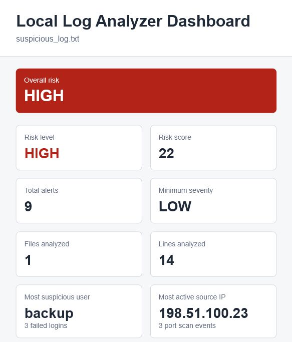
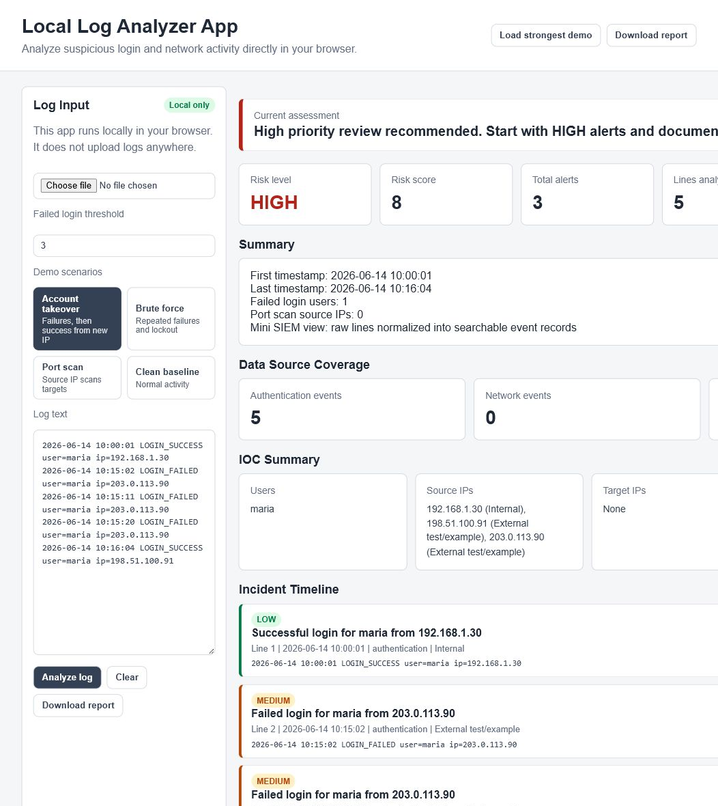
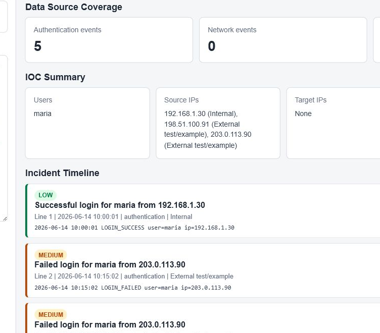
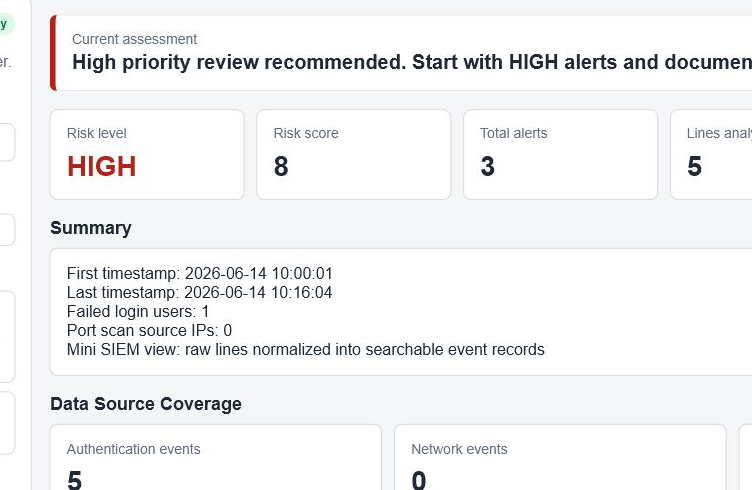
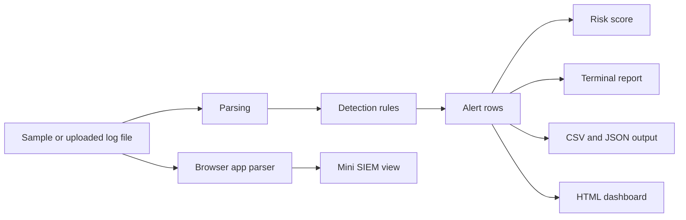

# Local Log Analyzer

Local Log Analyzer is a focused cybersecurity learning project for parsing local text logs, detecting common suspicious patterns, and generating analyst-style reports. It began as a small exploration of log analysis and later inspired the broader [AI-Cyberdefense](https://github.com/Veggis96/AI-Cyberdefense) project.

The project is designed for portfolio and learning use, especially for IT support, security operations, and junior cybersecurity roles.

## Project Evolution

Local Log Analyzer began as a small project for learning log parsing, basic detection logic, risk scoring, and security reporting.

After completing the initial version, I expanded the idea into [AI-Cyberdefense](https://github.com/Veggis96/AI-Cyberdefense), a larger SIEM/SOC-inspired project with normalized events, modular rule packs, incident workflows, MITRE ATT&CK context, SQLite persistence, and analyst-oriented dashboards.

## Live Demo

- [Project landing page](https://veggis96.github.io/local-log-analyzer/)
- [Browser-based learning demo](https://veggis96.github.io/local-log-analyzer/app.html)
- [Generated dashboard](https://veggis96.github.io/local-log-analyzer/dashboard.html)

## Problem The Project Solves

Security teams often start investigations by reviewing logs for repeated failed logins, suspicious source IPs, account lockouts, and successful logins after failures. This project simulates that workflow with local sample logs and beginner-readable detection logic.

## Key Features

- Analyzes `.txt` and `.log` files locally.
- Detects repeated failed logins, port scans, account lockouts, successful logins after failures, and successful logins from new IPs.
- Calculates simple severity and risk levels.
- Produces terminal output, `report.txt`, `alerts.csv`, `summary.json`, and `dashboard.html`.
- Includes a browser-only, small SIEM-style learning interface for pasted or uploaded logs.
- Provides demo scenarios for brute force, port scan, account takeover, and clean baseline activity.
- Includes MITRE ATT&CK and OWASP learning notes for common alert types.
- Includes interview notes, investigation guide, sample report, and portfolio documentation.

## Hero Screenshot

### Dashboard

Overview of risk level, alert count, analyzed files, and suspicious indicators.



## Additional Screenshots

### Incident List

Small SIEM-style browser view with demo scenarios, IOC summary, and incident timeline.



### Detection Details

Timeline and IOC details for suspicious login activity.



### Report

Risk summary and generated report-style output from the browser app.



## Architecture


```mermaid
flowchart LR
    A["Sample or uploaded log file"] --> B["Parsing"]
    B --> C["Detection rules"]
    C --> D["Alert rows"]
    D --> E["Risk score"]
    D --> F["Terminal report"]
    D --> G["CSV and JSON output"]
    D --> H["HTML dashboard"]
    A --> I["Browser app parser"]
    I --> J["Mini SIEM view"]
```

## Technology Stack

- Python 3
- Standard-library modules: `argparse`, `csv`, `json`, `ipaddress`, `datetime`, `os`, `html`
- HTML, CSS, and JavaScript for the browser app
- CSV, JSON, TXT, LOG, and HTML outputs
- Simple Python test script
- GitHub Pages for static demo hosting

## Project Structure

```text
analyzer.py                       Python command-line analyzer
app.html                          Browser-only learning demo
index.html                        GitHub Pages landing page
dashboard.html                    Generated demo dashboard
demo_summary.html / .csv          Generated demo scenario summary
sample_log.txt                    Basic sample log
suspicious_log.txt                Suspicious sample log
scenario_*.txt                    Focused demo scenarios
test_analyzer.py                  Test script
screenshots/                      Original screenshots
docs/images/                      README-optimized screenshots
*.md                              Portfolio, rules, guide, changelog and interview docs
```

`report.txt`, `alerts.csv`, `summary.json`, `dashboard.html`, and `demo_summary.*` are generated demo artifacts. They are currently committed so the repository can show example output and GitHub Pages content, but a future cleanup could move generated artifacts into an `outputs/` or `docs/demo-output/` folder.

## Prerequisites

- Python 3.10 or newer for the command-line analyzer
- A modern browser for `app.html`

No third-party Python packages are required.

## Quick Start

Run the most useful demo scenario:

```powershell
python analyzer.py --scenario account_takeover
```

Run all demo scenarios:

```powershell
python run_demo.py
```

Open the browser app locally:

```text
app.html
```

## Usage Examples

Analyze the default sample:

```powershell
python analyzer.py
```

Analyze a specific file:

```powershell
python analyzer.py suspicious_log.txt
```

List available scenarios:

```powershell
python analyzer.py --list-scenarios
```

Analyze all supported logs in a folder:

```powershell
python analyzer.py --log-folder C:\Logs
```

Change the failed-login threshold:

```powershell
python analyzer.py suspicious_log.txt --failed-login-limit 5
```

Save output files to another folder:

```powershell
python analyzer.py suspicious_log.txt --output-folder C:\Temp
```

Show only alerts at a minimum severity:

```powershell
python analyzer.py suspicious_log.txt --min-severity HIGH
```

## Testing

```powershell
python test_analyzer.py
```

Expected output:

```text
All tests passed.
```

## Security And Privacy Considerations

- The included logs are fake learning/demo data.
- Do not upload or commit real customer, employer, user, IP, hostname, or incident data.
- Real logs may contain sensitive usernames, source IPs, hostnames, session IDs, or authentication details.
- The project does not encrypt data, manage access control, or connect to live security systems.
- The browser app runs locally in the browser and is intended for demo data.

## Current Limitations

- This is not a production SIEM.
- Detection logic is intentionally simple and rule-based.
- It does not ingest real SIEM, EDR, firewall, or identity-provider feeds.
- It does not verify real threat intelligence.
- It does not block IPs, reset passwords, or modify security controls.

## Future Improvements

- Move generated output files into a dedicated demo output folder.
- Add date filtering and richer timeline grouping.
- Add more event types and parsing formats.
- Add configurable detection rules.
- Add more screenshots and a short demo GIF.
- Add a small package structure if the Python analyzer grows further.

## What I Learned

- Reading and parsing local log files with Python.
- Turning raw events into alerts, risk scores, and reports.
- Connecting basic detection logic to analyst workflows.
- Presenting a technical project with demos, screenshots, rules, and interview notes.

## AI-Assisted Development

This project was developed iteratively with the support of AI-assisted development tools. I defined and refined the project goals, requirements, architecture, technology choices and functionality, while reviewing, testing and improving the resulting implementation.

## License

This project is released under the [MIT License](LICENSE).
